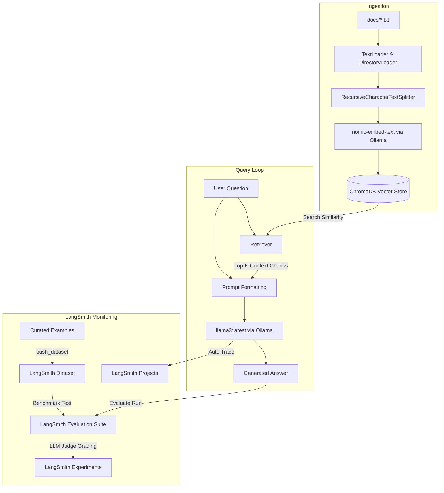

# System Solution Design (SSD): RAG App with LangSmith Integration

A production-ready, local-first Retrieval-Augmented Generation (RAG) application built in Python. The system is integrated with **LangSmith** for full execution tracing, dataset management, and automated evaluation.

---

## 1. System Goals

The RAG application orchestrates a local document query pipeline that:
1. **Ingests Documents**: Parses local `.txt` documents, segments them into overlapping chunks, generates vector embeddings, and indexes them in a local vector database.
2. **Answers Queries**: Retrieves the most semantically relevant text chunks matching a user query, inserts them as context into a prompt template, and invokes a local LLM to generate a grounded response.
3. **Traces Execution**: Automatically records latency, step-by-step inputs/outputs, and similarity search context in LangSmith via tracing decorators.
4. **Maintains Evaluation Benchmarks**: Exposes utility hooks to configure and populate Q&A evaluation datasets in LangSmith.
5. **Evaluates Pipeline Quality**: Runs automated evaluation suites leveraging LLM-as-a-judge metrics to grade pipeline answers on Correctness, Groundedness, and Retrieval Relevance.

---

## 2. System Architecture & Data Flow



---

## 3. Technology Stack

| Component | Technology | Rationale |
|---|---|---|
| **Orchestration** | LangChain Core & Community (v0.3.x) | Standard framework offering native LangSmith tracing integration. |
| **Embeddings** | Ollama `nomic-embed-text` | Local, high-performance, free embedding model. |
| **Vector Store** | ChromaDB (persisted to `./chroma_db/`) | Serverless vector database persisting index to disk. |
| **LLM Generator** | Ollama `llama3:latest` | Locally hosted 8B parameter LLM for high-quality generation. |
| **LLM Judge** | Ollama `llama3:latest` | Local LLM judge configured with `temperature=0.0` for evaluation. |
| **Tracing SDK** | LangSmith SDK (v0.9.x) | Captures traces and scores performance experiments. |
| **Compatibility Layer** | `langchain-classic` (v1.x) | Supplies backing string evaluators for local judge grading. |

---

## 4. Component Design & Code Structure

### 4.1 Ingestion module (`rag/ingest.py`)
- **Loader**: Uses `DirectoryLoader` and `TextLoader` to load all `.txt` documents in `data/sample_docs/`.
- **Text Splitter**: Uses `RecursiveCharacterTextSplitter` from `langchain_text_splitters` with `chunk_size=500` and `chunk_overlap=50`.
- **Database**: persists embeddings generated by `OllamaEmbeddings` into ChromaDB.

### 4.2 Pipeline module (`rag/pipeline.py`)
- Defines the `@traceable(name="rag_pipeline")` entry point.
- Connects the retriever with an `OllamaLLM` prompt generator.
- Returns a structured dictionary:
  ```python
  {
      "answer": str,               # The generated response
      "source_documents": list[str] # List of chunk texts retrieved from ChromaDB
  }
  ```

### 4.3 Dataset Manager (`langsmith_utils/push_dataset.py`)
- Connects to LangSmith and manages a dataset containing 20 curated Q&A pairs.
- Implements automatic deduplication:
  - Fetches existing examples in the dataset.
  - Deletes duplicate questions using `client.delete_example()`.
  - Inserts only unique/missing question items to guarantee idempotency.

### 4.4 Evaluation Suite (`langsmith_utils/evaluate.py`)
- Integrates `evaluate()` runner with a custom `LangChainStringEvaluator` adapter subclassing `RunEvaluator`.
- The adapter loads string criteria evaluators via `langchain_classic.evaluation.load_evaluator`.
- **Metrics Evaluated**:
  1. **Correctness** (`labeled_score_string`): Compares LLM answer against reference answer.
  2. **Groundedness** (`score_string`): Verifies if the answer is supported by the retrieved document context.
  3. **Retrieval Relevance** (`score_string`): Verifies if the retrieved documents match the question.

---

## 5. Configuration & Environment Variables

The system relies on a `.env` configuration file to locate services and credentials:

```bash
# LangSmith Credentials & Tracing Config
LANGSMITH_TRACING=true
LANGSMITH_API_KEY=lsv2_pt_...
LANGSMITH_PROJECT=rag-langsmith-demo

# Local Ollama Services Config
OLLAMA_BASE_URL=http://localhost:11434
OLLAMA_MODEL=llama3:latest
OLLAMA_EMBED_MODEL=nomic-embed-text
```
